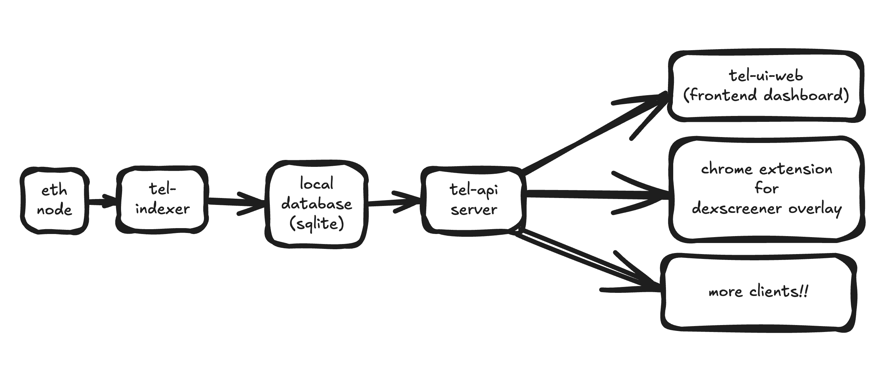

# tel-on-chain: On-Chain Buy/Sell Wall Visualizer


## What is tel-on-chain?

`tel-on-chain` is an aggregator platform that collects and visualizes buy/sell wall data from on-chain DEXs (such as Uniswap, Curve, Balancer, etc.). It helps traders intuitively identify key support/resistance price levels and liquidity concentration zones.

The platform integrates pool data from ethereum and multiple protocols, making them accessible through a single interface.

Implementation formats:

- [API Server](docs/API_V1.md)
- Frontend dashboard

The name originates from the Hebrew word "tel", meaning "hill". It metaphorically represents an "on-chain hill", symbolizing the ebb and flow of liquidity on a chart.

## Why tel-on-chain?

### 1. Difficulty in Understanding On-Chain Liquidity

Current on-chain exchanges are AMM-based rather than orderbook-based, making it difficult to understand liquidity structures and lacking intuitive supply/demand level information.

### 2. Key Indicators for Market Timing and Risk Management

Buy/sell walls are meaningful indicators that can indirectly reveal the intentions of institutions and whales. There's a lack of tools that can show this information in real-time and in an integrated manner.

### 3. Enhanced Transparency

While CEX orderbooks can be manipulated by exchanges, on-chain supply/demand levels can be transparently verified, making them a reliable source of market information due to their inherent transparency.

By structuring and providing this data, we can democratize access to valuable trading insights, making them available to everyone in the DeFi ecosystem.

## How We're Building It



### 1. Data Collection (Indexing)

- Collect pool data from major DEXs (Uniswap v2/v3/v4, Curve, Balancer, etc.) via RPC using `alloy-rs`.
- Calculate price-based liquidity distribution (liquidity ticks)
- Advanced feature: Time machine - Visualize not only real-time but also historical liquidity data

### 2. Aggregation & Analysis

- Integrate liquidity maps by chain/DEX for specific asset pairs
- Analyze liquidity density by price range (e.g., buy walls concentrated between $2200-$2300)
- Provide supplementary indicators like swap impact calculations
- For any token address, aggregate and visualize buy/sell liquidity across all DEXes and pools containing that token, providing a comprehensive view of market depth
- Track liquidity provider positions with detailed breakdowns of their shares and percentage contributions to each pool

### 3. Visualization and Interface

- Heat map visualization of price-based supply/demand levels
- Automatic detection of support/resistance levels
- TradingView-style chart overlay functionality (to aid trading strategy development)
- Provide real-time data to clients via API
- Open-source release with a DeFiLlama-like approach

### 4. Future Expansion

- Implement an example client featuring price wall-based alerts using the tel-on-chain API for instance, sending notifications when a buy wall drops below a specified threshold.
- Comparative analysis between CEX orderbooks and on-chain supply/demand levels
- Track liquidity movement of specific address groups (e.g., whales, MEV bots)
- Integration of Liquidation Maps
  - Visualize the distribution of possible liquidation positions in on-chain money markets like Aave, Compound, Morpho
  - Example: If ETH drops below $1,950, $10M worth of liquidations could occur
  - Overlay buy walls and liquidation maps to show intuitively which price levels might trigger rapid price movements

## Getting Started

### Prerequisites

- Rust 1.89.0
- SQLite

### Setup

1. Clone the repository:

   ```
   git clone https://github.com/decipherhub/tel-on-chain.git
   cd tel-on-chain
   ```

2. Build the project:
   ```
   cargo build
   ```

## Running the Application

### Starting the API Server

To start the API server:

```
cargo run --bin tel-on-chain api
```

The API server will be available at `http://localhost:8081`.

### Running the Indexer

To run the indexer for all configured DEXs:

```
cargo run --bin tel-on-chain index
```

To index a specific pool:

```
cargo run --bin tel-on-chain index --dex uniswap_v3 --pool 0x88e6a0c2ddd26feeb64f039a2c41296fcb3f5640
```

### Configuration

The configuration is stored in `config/default.toml`. You can specify:

- RPC endpoints for different blockchains
- Database connection settings
- API server settings
- DEXes to monitor and their factory addresses

### Project Structure

- `src/api`: API server implementation
- `src/config`: Configuration handling
- `src/core`: Core analysis logic (liquidity walls, support/resistance)
- `src/dexes`: DEX protocol adapters (Uniswap V2/V3, Sushiswap, etc.)
- `src/indexer`: Blockchain data indexing logic
- `src/models`: Data structures and types
- `src/providers`: Blockchain RPC providers
- `src/storage`: Database interaction
- `src/utils`: Utility functions

### API Documentation

API documentation is available at [docs/API_V1.md](docs/API_V1.md).

### Running the Debug UI

Built with egui that connects to the API and shows visualizations:

```
cargo run --bin tel-on-chain-ui
```

The UI allows you to:

- View liquidity walls for token pairs
- Check database contents
- Monitor indexer status

## API Documentation

### Endpoints

- `GET /health` - Health check
- `GET /v1/liquidity/walls/:token0/:token1` - Get liquidity walls for a token pair
- `GET /v1/tokens/:chain_id/:address` - Get token information
- `GET /v1/pools/:dex/:chain_id` - Get pools for a specific DEX on a chain

## Configuration

Tel-On-Chain uses a configuration file (config.toml) to specify RPC endpoints, DEXs to index, and other settings.

Example configuration:

```toml
[database]
url = "data/database.db"

[api]
host = "127.0.0.1"
port = 8080

[indexer]
interval_secs = 300

[ethereum]
url = "https://eth-mainnet.alchemyapi.io/v2/YOUR_API_KEY"

# DEX configurations
[[dexes]]
name = "uniswap_v3"
chain_id = 1
factory_address = "0x1F98431c8aD98523631AE4a59f267346ea31F984"
enabled = true
```

## Team

- [guzus](https://github.com/guzus)
  - CS major at Seoul National University
  - 3 years of experience in DeFi and MEV at a crypto trading firm
  - Winner at ETHGlobal Bangkok 2024 and Seoulana 2025 hackathons
- [0xGh-st](https://github.com/0xGh-st)
  - Dept. Of Financial Security, Blockchain major(master degree) at Korea University
  - Upside Academy(Upbit X Chainlight) 1st
  - Upbit D Conference(UDC) 2024 Speaker
  - Best Of the Best 12th Vulnerability Analysis
  - Ethcon Korea 2024 CTF Section Organizer
- [lee2020090791](https://github.com/lee2020090791)
  - CS major at Hanyang University
  - 1 year internship on OSDC labs
  - Blockchain core developer

## License

MIT
